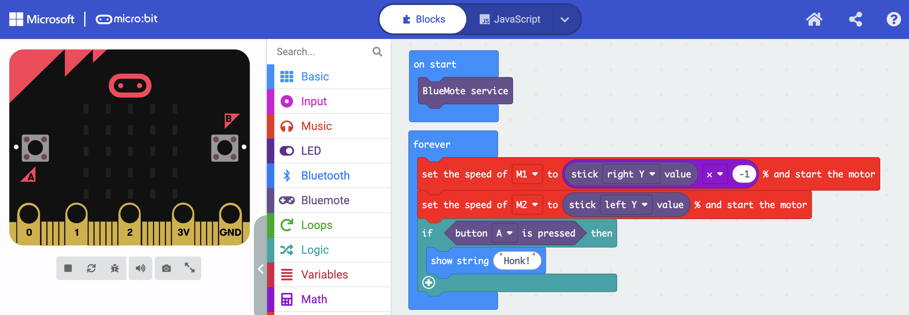

# BlueMote

A MakeCode extension that receives [BlueMote](https://antonsmindstorms.com/docs/bluemote) gamepad packets on a micro:bit over Bluetooth UART.



Start **BlueMote service** in **on start**, then read sticks and buttons from **forever**. The program above drives a two-motor robot: right stick Y to M1 (inverted so up is forward), left stick Y to M2, and BlueMote button A shows `Honk!`. The red motor blocks come from a separate motor extension.

BlueMote sends a **fixed 11-byte** packet (no newline or other delimiter). This extension reads that buffer with `bluetooth.uartReadBuffer()`, not the delimiter-based “on uart data received” blocks.

## Install

1. Open [makecode.microbit.org](https://makecode.microbit.org)
2. **Extensions** → paste the GitHub URL of this repo (or **Import URL**)
3. **Gear → Project Settings → No pairing required**

Adding this extension replaces **Radio** with **Bluetooth**. That is a MakeCode limitation.

The extension requests open (no-pairing) Bluetooth. If the micro:bit still asks to pair, set **No pairing required** in project settings and download again.

## Usage

Same idea without a motor extension — plot the left stick and honk on A:

```typescript
bluemote.startService()
basic.forever(function () {
    // Stick Y is screen-style (down is positive). Invert for "up = forward".
    // Example from the screenshot: M1 = 0 - stick right Y, M2 = stick left Y
    if (bluemote.buttonIsPressed(BlueMoteButton.A)) {
        basic.showString("Honk!")
    } else {
        led.plotBarGraph(bluemote.stickValue(BlueMoteStick.LeftY), 100)
    }
})
```

### Blocks

- `BlueMote service` — start the Bluetooth UART service and begin reading packets. Put this in **on start**.
- `button [up ▼] is pressed` — `true` while that BlueMote button is held: up, down, left, right, A, B, X, Y.
- `stick [left X ▼] value` — axis value **-100 to 100**: left X, left Y, right X, right Y.

Y is screen-style: **down is positive**. Invert in your program if the robot should treat up as forward: `0 - stick left Y value`.

Triggers and sliders are received in the packet but are not exposed as blocks yet.

## Connecting from the BlueMote app

The micro:bit advertises as `BBC micro:bit [xxxxx]` (the name cannot be changed). BlueMote’s default name filter is `robot`, which will **not** match.

- Clear the device-name filter so the picker lists all devices, or
- Set the filter to the full advertised name, e.g. `BBC micro:bit [tizet]`

You can show the five-letter name on the micro:bit with the **device name** block.

The micro:bit UART RX characteristic is **write with response** only. Current BlueMote builds fall back to that automatically. Older app builds that always use write-without-response will fail to send packets.

## Packet format

11 bytes, little-endian, same as BlueMote `GamepadState.toBytes()`:

| Offset | Type | Field |
| --- | --- | --- |
| 0 | int8 | left stick X (-100..100) |
| 1 | int8 | left stick Y (-100..100) |
| 2 | int8 | right stick X |
| 3 | int8 | right stick Y |
| 4 | uint8 | left trigger (0..200) |
| 5 | uint8 | right trigger |
| 6 | int16 | left setting |
| 8 | int16 | right setting |
| 10 | uint8 | button bitmask |

Button bits: 0 up, 1 down, 2 left, 3 right, 4 A, 5 B, 6 X, 7 Y.

for PXT/microbit
